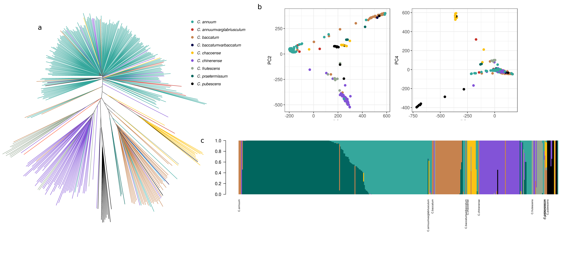
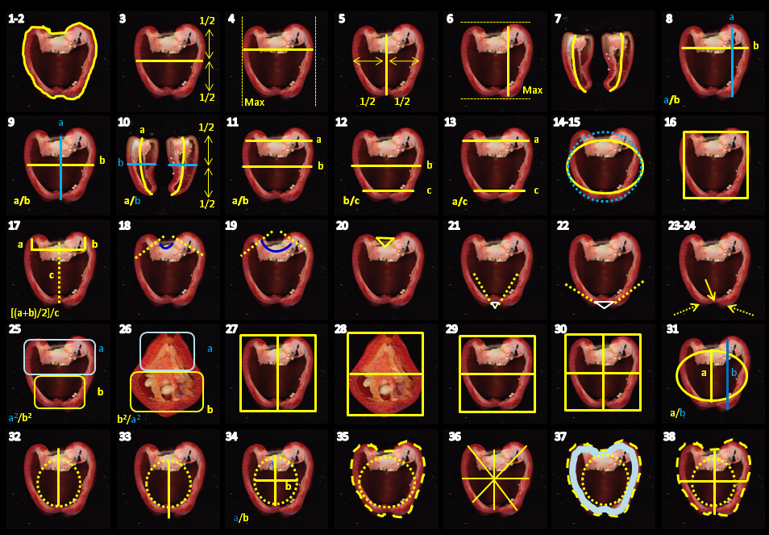
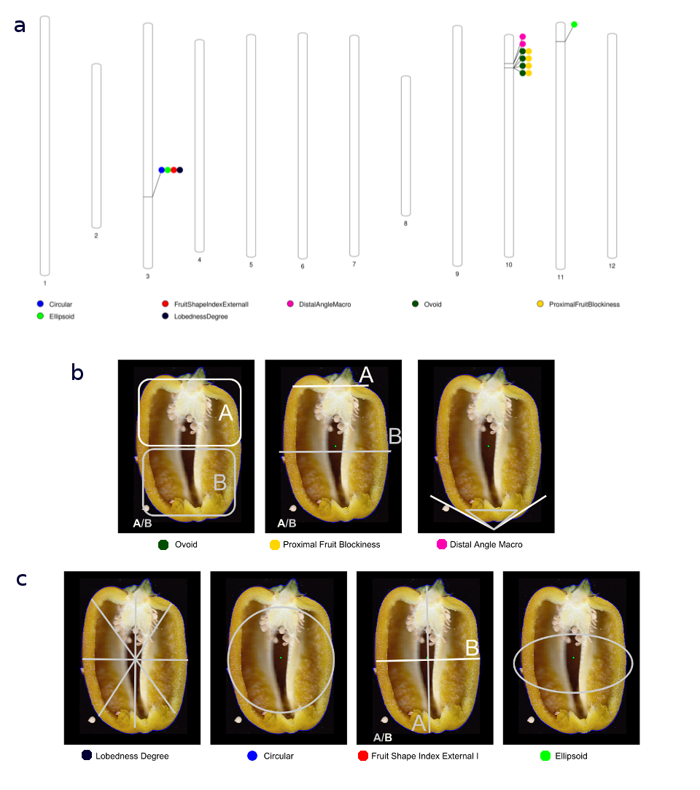
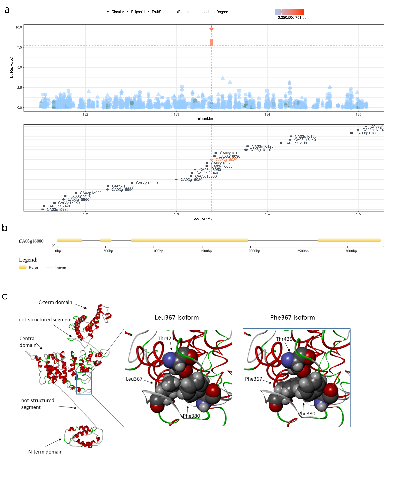

### The *Capsicum* collection 
*Capsicum* is one of the major vegetable crops grown world-wide. 
This website contains information on an exciting project on the genetics of *Capsicum*.  

**Samples Summary**

|           Species           | # of diploid accessions  |     Type     |
|:---------------------------:|:------------------------:|:------------:|
|         *C. annuum*         |            220           | domesticated |
|        *C. chinense*        |            62            | domesticated |
| *C. baccatum (varpendulum)* |            39            | domesticated |
|       *C. frutescens*       |            14            | domesticated |
|        *C. chacoense*       |            13            |     wild     |
|        *C.pubescens*        |            13            | domesticated |
|*C. annuum var glabriusculum*|             5            |     wild     |
|      *C. praetermissum*     |             3            |     wild     |
|  *C. baccatum var baccatum* |             2            | domesticated |
|      *C. galapagoense*      |             1            |     wild     |
|         *C.eximium*         |             1            |     wild     |

### Genomic diversity of the *Capsicum* genus at 746k variable sites.
We discovered 746k variable sites by sequencing 1.8% of the genome in a collection of 373 accessions belonging to 11 *Capsicum* species from 51 countries. 

The majority of variants is single nucleotide polymorphisms (SNP), followed multi-nucleotide polymorphisms (MNP) and insertions/deletion (INDEL). A very small fraction of variants is complex combinations of SNP, MNP, and INDEL. QUAL>10 refers to Phred-scaled quality scores.

### Population structure of *Capsicum* reveals strong subdivisions with little or no admixiture among species.

**Population structure of the *Capsicum* species derived from 746k genome variants.**

a)Phylogenetic reconstruction of the relationship between the accessions. With a few exceptions, clusters corrispond to species.
b)Principal component analysis. The first two components separate the three main domesticated species. The third and the fourth components separate *C. pubescens* and *C. chacoense* between them and from the cluster of domesticated species.
c)Model based admixture analysis in the hypothesis of seven clusters. With the exceptions of few admixed or misplaced individuals, clusters to corrispond to species and within *C. annuum* is possible to observe two groups with distinct genetic features.
  

### Insight into *C. annuum* fruit variability from high resolution phenotyping.

Fruits broad variability has been driven by breeding programs and has been mainly studied by linkage analysis. 
We carried out phenotyping of the 220 accessions of *C. annuum* at thirty-eight phenotypic traits, in order to describe and understand the range of variation of *C. annum* fruits.

**Graphic rapresentation of the phenotypes measured.**

**Bulky and large peppers are genetically differnet from small ones **

Subdivision within *C. annuum* accessions into two clusters is associated with significant differences in  four traits related to fruit size 

Accessions from *C. annuum* were assigned to genetic clusters determined in the admixture analysis if membership to the cluster was $>$90\%. Of the 38 traits, \textsc{Area}, \textsc{MaximumWidth}, \textsc{WidthMidHeight}, and \textsc{Perimeter} are significantly different between the two genetic clusters (Figure \ref{fig:pheno}c).Fruit size is significantly different between the two genetic clusters, with Cluster 1 having bulkier and larger fruits relative to Cluster 2. This suggests that differences in fruit size in \textit{C. annuum} might be caused by genetic differences. 

### Genetics of fruit in *C. annuum*.

**Results of the genome-wide association anlysis.**

a)We identified eight variants at four loci on three chromosomes, significant associated with seven traits. Circles represent association between one genetic variant and one trait. Colors distingish phenotype.
b)Cluster of phenotype determining whether fruits are pointed or squared.
c)Cluster of phenotypes determining if fruits are circular or elongated.

**Loci significantly associated with phenotypes related to fruit shape with genome-wide significance.**

Min/Maj = minor and major alleles; MAF = Minor Allele Frequency; β = Coefficient describing the effect size of the marker in the univariate linear model of association; SE = Standard Error of β; p-value = genome-wide Bonferroni corrected p-value for association.   

| Chr:position | Genomic region |          Nearest gene (kb)         | Min/Maj Alleles |  MAF |           Phenotype          |   β   |   SE  |  p-value |
|:------------:|:--------------:|:----------------------------------:|:---------------:|:----:|:----------------------------:|:-----:|:-----:|:--------:|
|  3:183386147 |   CA03g16080   |                  0                 |       C/T       | 0.13 |           Circular           |  0.10 | 0.016 | 1.36E-08 |
|              |                |                                    |                 |      |           Ellipsoid          |  0.03 | 0.005 | 1.58E-10 |
|              |                |                                    |                 |      | Fruit Shape Index External I |  0.91 | 0.145 | 4.93E-09 |
|              |                |                                    |                 |      |       Lobedness Degree       | 16.97 | 2.449 | 1.38E-10 |
|  10:28759675 |   Intergenic   |          CA10g04730 (-911)         |       T/C       | 0.36 |      Distal Angle Macro      | 18.47 | 2.962 | 4.97E-09 |
|  10:28759685 |   Intergenic   |          CA10g0473 (-910)          |       T/G       | 0.36 |      Distal Angle Macro      | 18.47 | 2.962 | 4.97E-09 |
|  10:33533810 |   Intergenic   | CA10g05040 (166) CA10g05050 (-156) |       C/T       | 0.22 |             Ovoid            | -0.08 | 0.012 | 8.87E-10 |
|              |                |                                    |                 |      |   Proximal Fruit Blockiness  | -0.12 | 0.018 | 1.91E-10 |
|  10:33533831 |   Intergenic   |  CA10g05040 (167) CA10g05050 (156) |       T/A       | 0.22 |             Ovoid            | -0.08 | 0.012 | 8.87E-10 |
|              |                |                                    |                 |      |   Proximal Fruit Blockiness  | -0.12 | 0.018 | 1.91E-10 |
|  10:33534094 |   Intergenic   | CA10g05040 (169) CA10g05050 (-156) |       T/A       | 0.22 |             Ovoid            | -0.08 | 0.012 | 8.87E-10 |
|              |                |                                    |                 |      |   Proximal fruit Blockiness  | -0.12 | 0.018 | 1.91E-10 |
|  10:33557960 |   Intergenic   | CA10g05040 (408) CA10g05050 (-132) |       C/G       |  0.1 |             Ovoid            | -0.15 | 0.024 | 5.43E-09 |
|              |                |                                    |                 |      |   Proximal fruit Blockiness  | -0.24 | 0.036 | 4.04E-10 |
|  11:18204293 |   Intergenic   | CA11g04570 (849) CA11g04580 (-892) |       T/A       | 0.06 |           Ellipsoid          |  0.04 | 0.006 | 4.39E-09 |

### A non-synonymous change in the *Longifolia 1-like* gene is associated with variance in *C. annuum* fruit elongation

**The *Longifolia 1-like* gene region.**

a)Locus zoom plot in a region of ±2Mb surrounding the non-synonymous mutation (3:183386147) in the gene *Longifolia 1-like* (CA03g16080) showing that the 3:183386147 variant is the only one reaching a genome-wide significant thereshold for genetic association in a region containing twenty-six genes. Color gradient indicate linkage desequilibrium mesuared ad r².
b)The predict genic structure of *Langifolia 1-like* (CA03g16080).
c)Predict protein structure for *Langifolia 1-like*.
 

**Allele frequencies at the single nucleotide polymorphism 3:18338614 in *Capsicum* species.**
 Numbers in parentheses indicate haploid sample size.

|     Species (n)    | CTC (Leu) | TTC (Phe) |
|:------------------:|-----------|-----------|
| *C. annuum (412)*  |    0.23   |    0.76   |
|*C. frutescens (28)*|    0.02   |    0.98   |
| *C. chinense (90)* |    0.03   |    0.97   |
| *C. baccatum (72)* |     0     |     1     |
| *C. chacoense (26)*|     0     |     1     |
| *C. pubescens (26)*|     0     |     1     |
